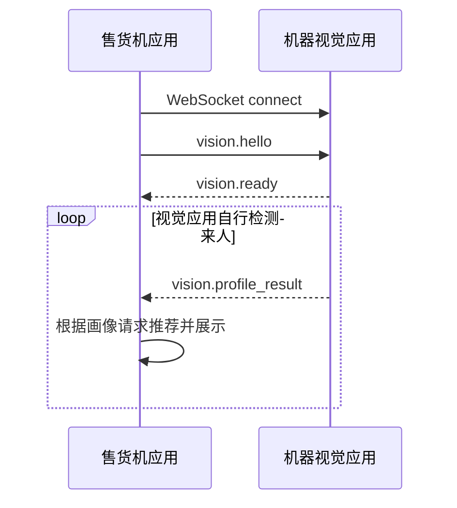

# 机器视觉模块通信协议

版本：`vem.vision.v1`

默认地址：`ws://127.0.0.1:7892/ws`

修改日期：2026-05-29

本协议采用“视觉端主动推送”模式。售货机应用连接本地视觉服务后，只负责握手、心跳和接收画像；视觉应用自行管理摄像头、人体检测、采集、推理和多帧统计。当识别到可用画像时，主动推送 `vision.profile_result`。没有有效人员时保持静默。

## 职责边界

售货机应用负责：

- 连接本地视觉 WebSocket 服务。
- 发送握手和心跳。
- 接收视觉画像推送。
- 将画像转换为推荐请求并刷新推荐商品。
- 视觉未连接、未收到画像或推荐失败时展示默认商品列表。
- 部署时启动、维护和关闭视觉进程。

机器视觉应用负责：

- 自行检测是否有人进入识别范围。
- 自行管理摄像头、模型加载、采集和推理。
- 有可用识别数据时主动推送 `vision.profile_result`。
- 未检测到有效人员时保持静默，不推送消息。
- 设备异常或协议异常时推送 `vision.error`。
- 只监听本地回环地址。

## 传输约定

| 项目 | 约定 |
| --- | --- |
| Transport | WebSocket，UTF-8 JSON 文本帧 |
| 默认监听 | `127.0.0.1:7892/ws` |
| 单帧大小 | 建议不超过 64 KiB |
| 二进制数据 | 禁止传图片或视频帧 |
| 心跳 | 双方可使用 `vision.ping` / `vision.pong` |
| 推送模型 | 视觉端检测到可用画像后主动推送 |
| 安全 | 只绑定 `127.0.0.1` 或 `::1` |

## 统一消息信封

```json
{
  "protocol": "vem.vision.v1",
  "type": "vision.profile_result",
  "messageId": "018fb994-c70e-7ec2-b4c3-90e6a7f2c8f1",
  "timestamp": "2026-05-29T12:00:00.000Z",
  "payload": {}
}
```

| 字段 | 类型 | 必填 | 说明 |
| --- | --- | --- | --- |
| `protocol` | string | 是 | 固定为 `vem.vision.v1` |
| `type` | string | 是 | 消息类型 |
| `messageId` | string | 是 | 发送方生成，用于日志追踪 |
| `timestamp` | ISO datetime | 是 | 发送时间 |
| `payload` | object | 是 | 消息载荷 |

## 售货机应用到视觉端

### `vision.hello`

连接建立后，售货机应用先发送握手消息。握手只声明身份和能力，不触发识别。

```json
{
  "protocol": "vem.vision.v1",
  "type": "vision.hello",
  "messageId": "hello-001",
  "timestamp": "2026-05-29T12:00:00.000Z",
  "payload": {
    "clientRole": "machine",
    "machineCode": "M001",
    "protocolVersion": 1,
    "capabilities": ["profile_push"]
  }
}
```

### `vision.ping`

```json
{
  "protocol": "vem.vision.v1",
  "type": "vision.ping",
  "messageId": "ping-001",
  "timestamp": "2026-05-29T12:00:03.000Z",
  "payload": {}
}
```

新版协议不再包含 `vision.start_profile` 和 `vision.cancel`。识别生命周期由视觉应用自行管理。

## 视觉端到售货机应用

### `vision.ready`

视觉端收到 `vision.hello` 后返回。售货机应用收到后保持连接，等待后续画像推送。

```json
{
  "protocol": "vem.vision.v1",
  "type": "vision.ready",
  "messageId": "ready-001",
  "timestamp": "2026-05-29T12:00:00.100Z",
  "payload": {
    "serverName": "vem-vision-python",
    "serverVersion": "0.2.0",
    "cameraReady": true,
    "modelReady": true,
    "capabilities": ["profile_push"]
  }
}
```

### `vision.profile_result`

视觉端识别到可用画像时主动推送。每次推送代表一次识别事件。

```json
{
  "protocol": "vem.vision.v1",
  "type": "vision.profile_result",
  "messageId": "result-001",
  "timestamp": "2026-05-29T12:00:04.000Z",
  "payload": {
    "eventId": "vision-event-20260529-0001",
    "detectedAt": "2026-05-29T12:00:03.900Z",
    "profile": {
      "personPresent": true,
      "heightCm": 172,
      "shoulderWidthCm": 43,
      "ageRange": "adult",
      "gender": "unknown",
      "bodyType": "regular",
      "upperColor": "dark",
      "confidence": 0.86
    },
    "quality": {
      "overall": "good",
      "warnings": []
    }
  }
}
```

### `vision.error`

设备不可用、模型未就绪或协议错误时推送标准错误。未检测到有效人员不是异常，视觉应用保持静默。

```json
{
  "protocol": "vem.vision.v1",
  "type": "vision.error",
  "messageId": "error-001",
  "timestamp": "2026-05-29T12:00:04.000Z",
  "payload": {
    "code": "camera_unavailable",
    "message": "camera unavailable",
    "retryable": true
  }
}
```

错误码：

| code | retryable | 说明 |
| --- | --- | --- |
| `invalid_message` | false | JSON 格式或字段不符合协议 |
| `unsupported_version` | false | 协议版本不兼容 |
| `camera_unavailable` | true | 摄像头不可用 |
| `model_not_ready` | true | 模型未加载完成 |
| `internal_error` | true | 视觉端内部异常 |

### `vision.pong`

视觉端收到 `vision.ping` 后返回。

## 正常时序



## 当前实现说明

当前 Python 实现会在握手后启动后台推送循环：

- 每轮采集 `profile_sample_count` 张候选帧。
- 每张候选帧执行一次画像推理。
- 过滤掉无人或置信度低于 `profile_min_confidence` 的帧。
- 至少保留 `profile_min_valid_frames` 张有效帧才会推送。
- 数值字段取中位数，类别字段取众数。
- 推送后等待 `profile_push_cooldown_ms`，避免同一个人频繁触发推荐。
