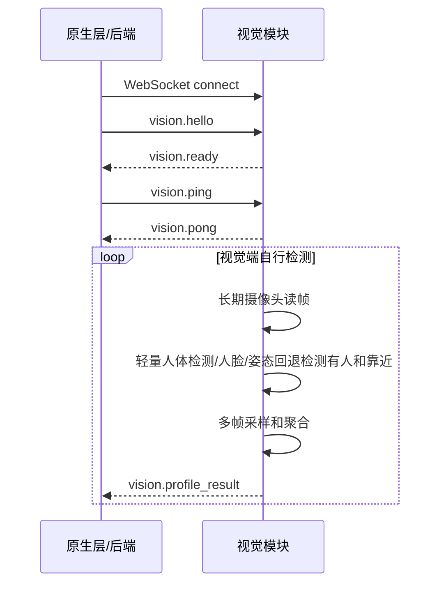

# 通信协议说明

协议版本：`vem.vision.v1`

默认地址：`ws://127.0.0.1:7892/ws`

当前模式：视觉端主动推送。

## 职责边界

售货机原生层/后端：

- 建立 WebSocket 连接。
- 发送 `vision.hello`。
- 定期发送 `vision.ping`，接收 `vision.pong`。
- 等待视觉端主动推送 `vision.profile_result`。
- 长时间没有画像时展示默认商品。

视觉模块：

- 自己管理长期摄像头连接、靠近检测、采样、推理和聚合。
- 摄像头读帧失败时自动重连；重连仍失败时推送 `vision.error`。
- 没有有效用户时保持静默。
- 有可用画像时主动推送 `vision.profile_result`。
- 摄像头、模型或协议异常时推送 `vision.error`。

新协议不再要求原生层发送 `vision.start_profile` 或 `vision.cancel`。

## 统一消息结构

所有消息都是 UTF-8 JSON 文本：

```json
{
  "protocol": "vem.vision.v1",
  "type": "vision.hello",
  "messageId": "hello-001",
  "timestamp": "2026-06-01T12:00:00.000Z",
  "payload": {}
}
```

| 字段 | 类型 | 必填 | 说明 |
| --- | --- | --- | --- |
| `protocol` | string | 是 | 固定为 `vem.vision.v1` |
| `type` | string | 是 | 消息类型 |
| `messageId` | string | 是 | 消息 ID，用于日志追踪 |
| `timestamp` | string | 是 | ISO 时间 |
| `payload` | object | 是 | 消息内容 |

## 原生层到视觉模块

### vision.hello

连接建立后发送一次。

```json
{
  "protocol": "vem.vision.v1",
  "type": "vision.hello",
  "messageId": "hello-001",
  "timestamp": "2026-06-01T12:00:00.000Z",
  "payload": {
    "clientRole": "machine",
    "machineCode": "M001",
    "protocolVersion": 1,
    "capabilities": ["profile_push"]
  }
}
```

### vision.ping

用于心跳。

```json
{
  "protocol": "vem.vision.v1",
  "type": "vision.ping",
  "messageId": "ping-001",
  "timestamp": "2026-06-01T12:00:03.000Z",
  "payload": {}
}
```

## 视觉模块到原生层

### vision.ready

收到 `vision.hello` 后返回。

```json
{
  "protocol": "vem.vision.v1",
  "type": "vision.ready",
  "messageId": "ready-001",
  "timestamp": "2026-06-01T12:00:00.100Z",
  "payload": {
    "serverName": "vem-vision-python",
    "serverVersion": "0.2.0",
    "cameraReady": true,
    "modelReady": true,
    "capabilities": ["profile_push"]
  }
}
```

### vision.pong

收到 `vision.ping` 后返回。

```json
{
  "protocol": "vem.vision.v1",
  "type": "vision.pong",
  "messageId": "pong-001",
  "timestamp": "2026-06-01T12:00:03.100Z",
  "payload": {}
}
```

### vision.presence_status

展示面板声明 `capabilities` 包含 `presence_status` 时，视觉模块会额外推送该辅助状态。该消息用于 Dashboard 实时显示“当前无人”“接近中”“画像暂不可用”，原生层/后端推荐算法可以忽略。

```json
{
  "protocol": "vem.vision.v1",
  "type": "vision.presence_status",
  "messageId": "status-vision-event-xxx",
  "timestamp": "2026-06-01T12:00:03.500Z",
  "payload": {
    "eventId": "vision-event-xxx",
    "detectedAt": "2026-06-01T12:00:03.500Z",
    "state": "empty",
    "reason": "no_person",
    "personPresent": false,
    "closeNow": false,
    "close": false,
    "proximity": {}
  }
}
```

### vision.profile_result

检测到用户靠近并得到可用画像后主动推送。

```json
{
  "protocol": "vem.vision.v1",
  "type": "vision.profile_result",
  "messageId": "result-vision-event-xxx",
  "timestamp": "2026-06-01T12:00:04.000Z",
  "payload": {
    "eventId": "vision-event-xxx",
    "detectedAt": "2026-06-01T12:00:03.900Z",
    "profile": {
      "personPresent": true,
      "heightCm": 172,
      "shoulderWidthCm": 43,
      "ageRange": "adult",
      "gender": "unknown",
      "bodyType": "regular",
      "upperColor": "dark",
      "confidence": 0.86
    },
    "quality": {
      "overall": "fair",
      "warnings": [],
      "sampleCount": 3,
      "validFrameCount": 2,
      "minValidFrames": 1,
      "targetSampleCount": 5,
      "faceVoteFrameCount": 2,
      "faceVoteQualifiedFrameCount": 3,
      "samplingMode": "approach_buffer_immediate_close",
      "proximity": {
        "present": true,
        "close": true,
        "closeNow": true,
        "closeTrigger": "close_now",
        "personReady": true,
        "personPresent": true,
        "largestPersonRatio": 0.21,
        "facePresent": true,
        "bodyPresent": false,
        "largestFaceRatio": 0.018,
        "bodyBoxRatio": 0.0,
        "method": "person_detector+face_area_ratio"
      }
    }
  }
}
```

画像字段：

| 字段 | 类型 | 说明 |
| --- | --- | --- |
| `personPresent` | boolean | 是否检测到有效用户 |
| `heightCm` | number/null | 粗略身高 |
| `shoulderWidthCm` | number/null | 粗略肩宽 |
| `ageRange` | string | `child`、`teen`、`adult`、`senior`、`unknown` |
| `gender` | string | `male`、`female`、`unknown` |
| `bodyType` | string | `slim`、`regular`、`strong`、`unknown` |
| `upperColor` | string | 上衣颜色类别 |
| `confidence` | number | 0 到 1 的整体置信度 |

`quality.proximity` 是调试辅助字段，说明本次触发主流程时的靠近判断状态。原生层推荐算法可以忽略它，只消费 `profile`。常见字段：

| 字段 | 类型 | 说明 |
| --- | --- | --- |
| `present` | boolean | 是否检测到有人 |
| `close` | boolean | 是否满足连续靠近条件 |
| `personReady` | boolean | 轻量人体检测模型是否可用 |
| `personPresent` | boolean | 人体框面积是否达到有人阈值 |
| `personCloseNow` | boolean | 当前帧人体框面积是否达到靠近阈值 |
| `largestPersonRatio` | number | 最大人体框面积占监控图比例 |
| `largestPersonScore` | number/null | 最大人体框检测分数 |
| `facePresent` | boolean | 人脸面积是否达到有人阈值 |
| `faceCloseNow` | boolean | 当前帧人脸面积是否达到靠近阈值 |
| `bodyPresent` | boolean | 人体姿态框是否达到有人阈值 |
| `bodyCloseNow` | boolean | 当前帧人体姿态框是否达到靠近阈值 |
| `bodySkipped` | boolean | 是否因人体检测/人脸已明确靠近而跳过姿态回退 |
| `largestFaceRatio` | number | 最大人脸框面积占监控图比例 |
| `bodyBoxRatio` | number | 可见人体姿态点外接框面积占监控图比例 |
| `method` | string | 当前靠近检测方法 |

### vision.error

发生异常时推送。未检测到人不是异常，不会推送错误。

```json
{
  "protocol": "vem.vision.v1",
  "type": "vision.error",
  "messageId": "error-001",
  "timestamp": "2026-06-01T12:00:04.000Z",
  "payload": {
    "code": "camera_unavailable",
    "message": "camera unavailable",
    "retryable": true
  }
}
```

错误码：

| code | retryable | 说明 |
| --- | --- | --- |
| `invalid_message` | false | JSON 格式或字段不符合协议 |
| `unsupported_version` | false | 协议版本不匹配 |
| `camera_unavailable` | true | 摄像头不可用 |
| `model_not_ready` | true | 模型未就绪 |
| `internal_error` | true | 视觉模块内部异常 |

## 正常时序



## HTTP 运维接口

WebSocket 是业务协议；下面接口用于本机联调、健康检查和现场运维。

| 方法 | 路径 | 说明 |
| --- | --- | --- |
| `GET` | `/health` | 返回服务、模型和实时摄像头状态 |
| `GET` | `/camera/status` | 返回摄像头实际参数、长期连接状态、读帧计数和重连次数 |
| `POST` | `/camera/reopen` | 手动释放并重新打开摄像头连接 |
| `GET` | `/proximity/check` | 单次靠近检测，返回人脸和人体辅助判断字段 |

`/camera/status` 中的 `stream.reconnectCount` 可用于判断长期运行期间摄像头是否发生过重连；`stream.lastError` 可用于定位最近一次摄像头异常。

## 过程追踪字段

普通模式下不保存过程图，也不要求后端处理 trace 字段。

开启过程追踪模式后，`quality` 可能包含：

```json
{
  "trace": {
    "eventDir": "debug_outputs\\process_traces\\20260601_203000_vision-event-xxx"
  }
}
```

该字段仅用于本机展示和排查，原生层可以忽略。
