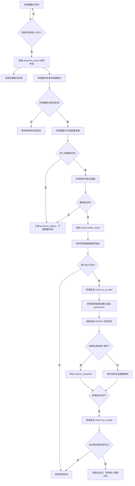

# 摄像头布置与识别流程方案

本文档记录售货机视觉模块的最终摄像头方案，用于对齐结构设计、前端试衣、软件推荐层、智能语音层和视觉服务实现。

## 方案结论

采用“两类摄像头、两套职责”的方案：

| 摄像头 | 安装位置 | 常开状态 | 主要职责 |
| --- | --- | --- | --- |
| 顶部球形摄像头 | 售货机顶部，俯视或广角观察柜体前方区域 | 常开 | 判断有没有人进入、有没有人离开、是否多人 |
| 中部正面摄像头 | 屏幕旁边或屏幕中上区域，面向用户 | 按需开启 | 人物字段识别、推荐画像采集、前端试衣画面 |

核心原则：

- 顶部摄像头只负责场景状态，不负责人物画像字段。
- 中部摄像头负责高质量正面画面，是人物字段推送和试衣 MJPEG 预览的主摄像头。
- 试衣功能优先级高于视觉画像采集。
- 前端不直接调用物理摄像头；前端通过 `vision.try_on.start/stop` 管理试衣会话，并渲染视觉服务返回的 `previewUrl`。
- 只有“单人 + 中部摄像头画面可用 + 画像置信度达标”时，才推送人物字段。

## 职责边界

### 顶部球形摄像头

顶部摄像头负责低成本、持续运行的场景感知：

- 检测售货机前方是否有人进入。
- 判断用户是否离开交互区域。
- 判断是否存在多人。
- 给中部摄像头、软件层、语音层提供触发信号。

顶部摄像头不用于：

- 年龄识别。
- 性别识别。
- 身高、肩宽、体型估计。
- 上衣颜色识别。
- 试衣画面。

### 中部正面摄像头

中部摄像头负责高价值画面：

- 采集人物画像字段。
- 采集用户正面或准正面上半身画面。
- 支持前端试衣 MJPEG 预览。
- 在视觉画像采集和试衣会话之间进行控制权切换。

中部摄像头输出的人物字段包括：

- `personPresent`
- `heightCm`
- `shoulderWidthCm`
- `ageRange`
- `gender`
- `bodyType`
- `upperColor`
- `confidence`

## 主流程



## 状态机建议

视觉服务建议维护会话状态：

| 状态 | 含义 |
| --- | --- |
| `EMPTY` | 顶部摄像头未检测到用户 |
| `APPROACH_DETECTED` | 顶部摄像头检测到有人进入 |
| `WAIT_FRONT_CAMERA` | 等待中部摄像头空闲或等待正面画面可用 |
| `PROFILING` | 中部摄像头正在采集画像字段 |
| `PROFILE_PUSHED` | 已推送本次会话画像 |
| `BROWSING` | 用户正在浏览或软件层正在推荐 |
| `TRYON_ACTIVE` | 视觉服务正在为前端提供试衣 MJPEG 预览 |
| `TRYON_RETURNED` | 前端已发送 `vision.try_on.stop`，试衣会话结束 |
| `DEPARTED` | 顶部摄像头确认用户离开 |
| `MULTIPLE_PEOPLE` | 检测到多人，不推送画像字段 |

## 画像采集策略

当前采用“灵敏优先、多人严格”的短窗口策略。与原策略的差异如下：

| 参与方 | 原策略 | 当前灵敏策略 |
| --- | --- | --- |
| 顶部摄像头 | 8 帧窗口、约 5 帧确认单人 | 任一人体/人脸/姿态证据立即确认有人；明确多人立即确认，多路证据均消失约 0.6 秒后确认无人 |
| 中部摄像头 | 达到近距离后才开始约 3 秒采样 | 稳定单人即预采样，近距离或达到时间下限后提前结束 |
| 画像质量 | 低于 0.35 或字段不足时通常不推送 | 置信度达到 0.25、至少两帧有效时允许部分画像 |
| 软件层 | 等待较完整画像再推荐 | 使用已有字段立即推荐，`null/unknown` 回退通用策略 |

中部摄像头不只抓一帧，也不无限等待：

| 参数 | 建议值 |
| --- | --- |
| 采样窗口 | 最长 `2s` |
| 最大等待时间 | `3s` |
| 采样间隔 | `125ms`（目标 8 FPS） |
| 最少有效帧 | `2` 帧 |
| 提前结束条件 | 近距离且两帧有效，或预采样满 1 秒且两帧有效 |

画像推送条件：

```text
顶部摄像头任一检测器确认有人且没有多人证据
+ 顶部摄像头未检测到多人
+ 中部摄像头空闲
+ 中部摄像头至少得到两帧有效画像
+ 聚合置信度达到 0.25
+ 推送前顶部摄像头仍确认单人
=> 推送 vision.profile_result
```

如果超过最大等待时间仍无法得到可用画像：

- 不推送 `vision.profile_result`。
- 只推送 `vision.presence_status`。
- 软件层可以先展示通用推荐。
- 后续如果中部画面变得可用，可以补推画像结果。

## 推送时机

顶部摄像头负责确认单人，正面摄像头在用户靠近过程中提前工作；预采样本身不会绕过最终单人复检。

推荐时机：

1. 顶部摄像头检测到用户进入交互区。
2. 软件层和语音层收到 `presence_status`。
3. 语音层立即播放欢迎语。
4. 顶部一帧确认有人且没有多人证据后，视觉服务尝试占用中部摄像头并立即预采样。
5. 中部摄像头得到两帧有效结果后尽快聚合；缺失字段保留 `null/unknown`。
6. 推送前再次检查顶部仍为单人，再发送 `vision.profile_result`。
7. 软件层使用已有字段推荐，缺失字段回退通用商品策略。

这样可以兼顾响应速度和画像质量。

## 中部摄像头控制权

中部摄像头需要明确内部控制权，建议抽象为：

```text
owner = idle | vision | tryon_frontend
```

优先级：

```text
tryon_frontend > vision > idle
```

控制规则：

- 视觉服务只有在 `owner=idle` 时才能占用中部摄像头。
- 前端进入试衣时发送 `vision.try_on.start`，不直接打开摄像头。
- 如果当前 `owner=vision`，视觉服务应暂停画像采集并切换到试衣预览。
- 试衣期间，视觉服务暂停中部摄像头画像采集。
- 试衣期间，顶部摄像头继续监控用户是否离开。
- 前端退出试衣、路由离开或会话被替换时，需要发送 `vision.try_on.stop`。

## 试衣期间的特殊逻辑

试衣期间中部摄像头由视觉服务继续独占，视觉服务向前端提供本地 HTTP MJPEG 预览流；视觉画像采集暂停。

顶部摄像头仍然常开，并持续判断用户是否离开：

| 情况 | 处理 |
| --- | --- |
| 试衣期间用户未离开 | 试衣结束后继续沿用当前会话画像，不重复推荐 |
| 试衣期间顶部确认用户离开 | 标记 `session_departed=true` |
| 前端归还摄像头后顶部仍无人 | 结束会话，清空画像缓存 |
| 前端归还摄像头后顶部检测到新人 | 重新进入欢迎、画像采集、推荐流程 |

## 多人场景

多人场景下不推送人物画像字段。

判断逻辑：

- 顶部摄像头检测到多人，进入 `MULTIPLE_PEOPLE`。
- 中部摄像头检测到多人，也进入 `MULTIPLE_PEOPLE`。
- 多人状态只推送 `vision.presence_status`。
- 软件层可以提示“请一位用户站到屏幕前”。
- 直到顶部摄像头重新确认单人或无人后，再允许进入画像流程。

对外状态示例：

```json
{
  "type": "vision.presence_status",
  "payload": {
    "state": "occupied",
    "reason": "multiple_people_detected",
    "personPresent": true,
    "occupancy": {
      "state": "multiple",
      "confidence": 0.78
    }
  }
}
```

## 当前视觉逻辑

```text
顶部摄像头检测场景状态
-> 中部摄像头申请控制权
-> 中部摄像头采集画像字段
-> 试衣时释放中部摄像头
-> 顶部摄像头持续负责离开判断
```

需要避免：

- 顶部摄像头检测到人后直接推送画像字段。
- 中部摄像头被前端试衣占用时，视觉服务仍尝试读取。
- 试衣结束后无条件重新画像，导致重复推荐。
- 多人场景下误推某一个人的画像字段。

## 软件层与前端协作点

### 软件层

软件层需要处理三类消息：

- `vision.presence_status`：有人、无人、多人、等待正面画面等状态。
- `vision.profile_result`：人物画像字段，用于推荐。
- `vision.person_departed`：用户离开，用于结束会话或清空推荐上下文。

### 智能语音层

语音层建议使用顶部摄像头触发的状态：

- 顶部检测到有人进入时播放欢迎语。
- 多人时可播放引导语。
- 用户离开后可停止当前交互语音或重置会话。

### 前端试衣

前端进入试衣前：

- 通过 WebSocket 发送 `vision.try_on.start`。
- 等待 `vision.try_on.started`。
- 使用返回的 `previewUrl` 渲染 MJPEG 预览。

前端退出试衣后：

- 发送 `vision.try_on.stop`。
- 等待或兼容接收 `vision.try_on.stopped`。
- 视觉服务根据顶部摄像头状态决定是否继续当前会话。

## 当前代码实现状态

目前项目已按 MVP 方式接入该流程：

- 顶部摄像头使用 `top` 角色，负责 `presence_status`、多人状态和离开事件判断。
- 中部摄像头使用 `front` 角色，负责画像采样和试衣 MJPEG 预览。
- 中部摄像头 owner 为 `idle | vision | tryon_frontend`，试衣优先级高于画像采样。
- `presence_status.occupancy.state=multiple` 时不推画像字段。
- `presence_status.state=waiting` 且 `reason=front_camera_reserved_by_tryon` 时暂停新的中部画像采集。
- `presence_status.state=waiting` 且 `reason=front_camera_busy` 或 `front_camera_owner_changed` 时表示中部摄像头暂不可用或被占用。
- 试衣期间如果顶部摄像头确认用户离开，视觉端通过独立的 `vision.person_departed` 通知软件层清空旧推荐上下文。
- `vision.try_on.started` 只返回 `sessionId`、`previewUrl`、`streamType`；`vision.try_on.stopped` 只返回 `sessionId`、`reason`。

## 已实现模块

- `vision/camera_manager.py`：按 `top/front` role 管理摄像头读取、状态和重连。
- `vision/camera_owner.py`：管理中部摄像头 `idle | vision | tryon_frontend` 控制权。
- `vision/try_on_session.py`：管理试衣会话和 MJPEG 预览流。
- `vision/session_state.py`：管理视觉购物会话、画像缓存和试衣期间离开标记。
- `vision/proximity.py`：默认读取顶部摄像头做 presence/close/multiple 判断。
- `vision/profile_push.py`：接入顶部状态、中部画像采样和 WebSocket 协议推送。

后续主要是现场联调，不再是代码结构拆分：

- 顶部摄像头实际 FOV 和多人阈值标定。
- 中部摄像头画面质量、试衣 MJPEG 帧率和分辨率联调。
- 前端异常离开时 `vision.try_on.stop` 的兜底。
- 软件层按 `profile_result`、`person_departed` 和试衣页本地会话状态管理推荐上下文。

## 待确认问题

以下问题需要结构、前端、软件层和视觉一起确认：

1. 顶部球形摄像头的实际视场角和安装高度。
2. 顶部摄像头是否能稳定覆盖售货机前方 `600mm - 1200mm` 交互区。
3. MJPEG 预览流的帧率、分辨率和浏览器渲染性能。
4. 前端在路由离开、异常关闭、会话替换时如何保证发送 `vision.try_on.stop`。
5. 软件层是否允许先展示通用推荐，再根据画像结果刷新推荐。
6. 多人状态下的界面和语音提示文案。

