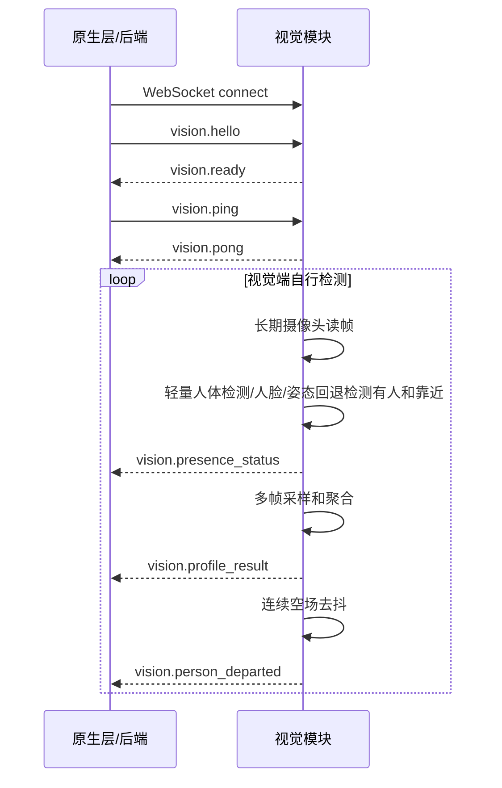

# 通信协议说明

协议版本：`vem.vision.v1`

默认地址：`ws://127.0.0.1:7892/ws`

当前模式：视觉端主动推送。

## 职责边界

售货机原生层/后端：

- 建立 WebSocket 连接。
- 发送 `vision.hello`。
- 定期发送 `vision.ping`，接收 `vision.pong`。
- 等待视觉端主动推送 `vision.profile_result`。
- 长时间没有画像时展示默认商品。

视觉模块：

- 自己管理长期摄像头连接、靠近检测、采样、推理和聚合。
- 摄像头读帧失败时自动重连；重连仍失败时推送 `vision.error`。
- 没有有效用户时保持静默。
- 有可用画像时主动推送 `vision.profile_result`。
- 摄像头、模型或协议异常时推送 `vision.error`。

新协议不再要求原生层发送 `vision.start_profile` 或 `vision.cancel`。

## 统一消息结构

所有消息都是 UTF-8 JSON 文本：

```json
{
  "protocol": "vem.vision.v1",
  "type": "vision.hello",
  "messageId": "hello-001",
  "timestamp": "2026-06-01T12:00:00.000Z",
  "payload": {}
}
```

| 字段 | 类型 | 必填 | 说明 |
| --- | --- | --- | --- |
| `protocol` | string | 是 | 固定为 `vem.vision.v1` |
| `type` | string | 是 | 消息类型 |
| `messageId` | string | 是 | 消息 ID，用于日志追踪 |
| `timestamp` | string | 是 | ISO 时间 |
| `payload` | object | 是 | 消息内容 |

校验规则：

- 上述信封字段必须存在，且 `protocol`、`type`、`messageId`、`timestamp` 必须是非空字符串。
- `payload` 必须是对象。
- `protocol` 不等于 `vem.vision.v1` 时返回 `vision.error`，code 为 `unsupported_version`。
- 信封格式或 payload 字段不符合消息要求时返回 `vision.error`，code 为 `invalid_message`。

## 原生层到视觉模块

### vision.hello

连接建立后发送一次。

```json
{
  "protocol": "vem.vision.v1",
  "type": "vision.hello",
  "messageId": "hello-001",
  "timestamp": "2026-06-01T12:00:00.000Z",
  "payload": {
    "clientRole": "machine",
    "machineCode": "M001",
    "protocolVersion": 1,
    "capabilities": ["profile_push", "presence_status", "person_departed", "ambient_light", "try_on_session"]
  }
}
```

`vision.hello.payload` 要求：

| 字段 | 类型 | 必填 | 说明 |
| --- | --- | --- | --- |
| `clientRole` | string | 否 | 客户端角色，例如 `machine` 或 `dashboard` |
| `machineCode` | string | 否 | 机器编号，用于日志和联调 |
| `protocolVersion` | number | 是 | 当前必须为 `1` |
| `capabilities` | string[] | 是 | 客户端希望消费的能力，推荐包含 `profile_push`、`presence_status`、`person_departed`、`ambient_light`、`try_on_session` |

### vision.ping

用于心跳。

```json
{
  "protocol": "vem.vision.v1",
  "type": "vision.ping",
  "messageId": "ping-001",
  "timestamp": "2026-06-01T12:00:03.000Z",
  "payload": {}
}
```

## 视觉模块到原生层

### vision.ready

收到 `vision.hello` 后返回。

```json
{
  "protocol": "vem.vision.v1",
  "type": "vision.ready",
  "messageId": "ready-001",
  "timestamp": "2026-06-01T12:00:00.100Z",
  "payload": {
    "serverName": "vem-vision-python",
    "serverVersion": "0.2.0",
    "cameraReady": true,
    "modelReady": true,
    "capabilities": ["profile_push", "presence_status", "person_departed", "ambient_light", "try_on_session"]
  }
}
```

### vision.pong

收到 `vision.ping` 后返回。

```json
{
  "protocol": "vem.vision.v1",
  "type": "vision.pong",
  "messageId": "pong-001",
  "timestamp": "2026-06-01T12:00:03.100Z",
  "payload": {}
}
```

### vision.presence_status

展示面板声明 `capabilities` 包含 `presence_status` 时，视觉模块会额外推送该辅助状态。若客户端同时声明 `ambient_light`，该消息会附带 `ambientLight.level` 三态，用于来人语音种类选择；缺省时客户端应回退普通语音。

```json
{
  "protocol": "vem.vision.v1",
  "type": "vision.presence_status",
  "messageId": "status-vision-event-xxx",
  "timestamp": "2026-06-01T12:00:03.500Z",
  "payload": {
    "eventId": "vision-event-xxx",
    "detectedAt": "2026-06-01T12:00:03.500Z",
    "state": "empty",
    "reason": "no_person",
    "personPresent": false,
    "closeNow": false,
    "close": false,
    "closeTrigger": null,
    "proximity": {},
    "ambientLight": {
      "level": "dim",
      "measuredAt": "2026-06-01T12:00:03.500Z",
      "source": "camera",
      "confidence": 0.82,
      "sample": {
        "lumaMean": 74.5
      }
    }
  }
}
```

常见 `presence_status.payload.state`：

| state | 说明 |
| --- | --- |
| `empty` | 顶部摄像头未检测到用户 |
| `approach` | 顶部摄像头检测到单人进入，尚未完成画像 |
| `occupied` | 当前会话已经推送过可用画像，未确认离开前不重复推送 |
| `waiting` | 中部摄像头暂不可用、试衣占用或 mock 等等待类状态 |
| `unusable` | 中部摄像头画面或字段质量不足，暂不推画像 |

多人状态通过 `payload.occupancy.state="multiple"` 表达，此时 `payload.state` 仍使用协议枚举，例如 `occupied`。试衣占用或中部摄像头暂不可用通过 `payload.state="waiting"` 搭配 `payload.reason` 表达，例如 `front_camera_reserved_by_tryon`、`front_camera_busy`。

### vision.profile_result

顶部摄像头任一人体、人脸或姿态检测器确认有人且没有多人证据后，正面摄像头立即预采样；得到至少两帧有效画像并通过最终“当前有人且无多人”复检后主动推送。用户尚未达到近距离也可形成部分画像。

```json
{
  "protocol": "vem.vision.v1",
  "type": "vision.profile_result",
  "messageId": "result-vision-event-xxx",
  "timestamp": "2026-06-01T12:00:04.000Z",
    "payload": {
      "eventId": "vision-event-xxx",
      "detectedAt": "2026-06-01T12:00:03.900Z",
      "occupancy": {
        "state": "single",
        "confidence": 0.82
      },
      "profile": {
      "personPresent": true,
      "heightCm": 172,
      "shoulderWidthCm": 43,
      "ageRange": "adult",
      "gender": "unknown",
      "bodyType": "regular",
      "upperColor": "dark",
      "confidence": 0.86
    },
      "quality": {
        "overall": "fair",
        "warnings": [],
        "profileUsable": true,
        "sampleCount": 3,
      "validFrameCount": 2,
      "minValidFrames": 2,
      "targetSampleCount": 6,
      "samplingMode": "top_presence_front_profile",
      "proximity": {
        "present": true,
        "close": true,
        "closeNow": true,
        "closeTrigger": "close_now",
        "personReady": true,
        "personPresent": true,
        "largestPersonRatio": 0.21,
        "facePresent": true,
        "bodyPresent": false,
        "largestFaceRatio": 0.018,
        "bodyBoxRatio": 0.0,
        "method": "person_detector+face_area_ratio"
      }
    }
  }
}
```

画像字段：

| 字段 | 类型 | 说明 |
| --- | --- | --- |
| `personPresent` | boolean | 是否检测到有效用户 |
| `heightCm` | number/null | 粗略身高 |
| `shoulderWidthCm` | number/null | 粗略肩宽 |
| `ageRange` | string | `child`、`teen`、`adult`、`senior`、`unknown` |
| `gender` | string | `male`、`female`、`unknown` |
| `bodyType` | string | `slim`、`regular`、`strong`、`unknown` |
| `upperColor` | string | 上衣颜色类别 |
| `confidence` | number | 0 到 1 的整体置信度 |

`profile_result.payload.occupancy` 是本次画像采样窗口对应的占用状态快照，语义同 `presence_status.payload.occupancy`。推荐层应先检查 `quality.profileUsable` 和 `occupancy.state`，只有可用单人画像才用于推荐。

画像允许只包含部分有效推荐字段；缺失值保持协议规定的 `null` 或 `unknown`。推荐层不得因为单个字段缺失而丢弃整份画像，应对缺失字段使用通用推荐策略。低置信度仍通过现有 `profile.confidence` 表达。

| 字段 | 类型 | 说明 |
| --- | --- | --- |
| `quality.profileUsable` | boolean | `true` 表示可用于推荐；`false` 表示仅用于诊断 |
| `quality.notUsableReason` | string | 可选，`multiple_people`、`no_person`、`low_confidence`、`insufficient_quality`、`unknown` |

`quality.proximity` 是调试辅助字段，说明本次触发主流程时的靠近判断状态。原生层推荐算法可以忽略它，只消费 `profile`。常见字段：

| 字段 | 类型 | 说明 |
| --- | --- | --- |
| `present` | boolean | 是否检测到有人 |
| `close` | boolean | 是否满足连续靠近条件 |
| `personReady` | boolean | 轻量人体检测模型是否可用 |
| `personPresent` | boolean | 人体框面积是否达到有人阈值 |
| `personCloseNow` | boolean | 当前帧人体框面积是否达到靠近阈值 |
| `largestPersonRatio` | number | 最大人体框面积占监控图比例 |
| `largestPersonScore` | number/null | 最大人体框检测分数 |
| `facePresent` | boolean | 人脸面积是否达到有人阈值 |
| `faceCloseNow` | boolean | 当前帧人脸面积是否达到靠近阈值 |
| `bodyPresent` | boolean | 人体姿态框是否达到有人阈值 |
| `bodyCloseNow` | boolean | 当前帧人体姿态框是否达到靠近阈值 |
| `bodySkipped` | boolean | 是否因人体检测/人脸已明确靠近而跳过姿态回退 |
| `largestFaceRatio` | number | 最大人脸框面积占监控图比例 |
| `bodyBoxRatio` | number | 可见人体姿态点外接框面积占监控图比例 |
| `method` | string | 当前靠近检测方法 |

### vision.person_departed

客户端声明 `capabilities` 包含 `person_departed` 时，视觉模块会在确认上一位用户离开当前交互区域后推送一次该边沿事件。它不同于周期性的 `presence_status.personPresent=false`：离开事件只在“有人/占用”转为空场时发送一次，直到下一次有人后才允许再次发送。

```json
{
  "protocol": "vem.vision.v1",
  "type": "vision.person_departed",
  "messageId": "departure-vision-departure-xxx",
  "timestamp": "2026-06-01T12:00:12.000Z",
  "payload": {
    "eventId": "vision-departure-xxx",
    "detectedAt": "2026-06-01T12:00:12.000Z",
    "lastSeenAt": "2026-06-01T12:00:10.800Z",
    "reason": "left_frame",
    "absenceDurationMs": 1200,
    "ambientLight": {
      "level": "bright",
      "measuredAt": "2026-06-01T12:00:12.000Z",
      "source": "camera",
      "confidence": 0.86
    }
  }
}
```

| 字段 | 类型 | 说明 |
| --- | --- | --- |
| `eventId` | string | 本次离开事件 ID |
| `detectedAt` | string | 视觉方确认离开的时间 |
| `lastSeenAt` | string/null | 最近一次确认有人时间 |
| `reason` | string | `no_person`、`left_frame`、`tracking_lost`、`absence_timeout`、`manual`、`unknown` |
| `absenceDurationMs` | number | 从最近有人到确认离开的估算时长 |
| `ambientLight` | object | 可选，字段同 `presence_status.payload.ambientLight` |

### vision.try_on.start / vision.try_on.started

前端试衣页请求中部正面摄像头预览时，通过 WebSocket 发送：

```json
{
  "protocol": "vem.vision.v1",
  "type": "vision.try_on.start",
  "messageId": "try-on-start-001",
  "timestamp": "2026-07-03T10:00:00.000Z",
  "payload": {
    "sessionId": "try-on-session-001",
    "catalogKey": "product:001",
    "variantId": "variant-001"
  }
}
```

视觉方返回：

```json
{
  "protocol": "vem.vision.v1",
  "type": "vision.try_on.started",
  "messageId": "try-on-started-try-on-session-001",
  "timestamp": "2026-07-03T10:00:00.100Z",
  "payload": {
    "sessionId": "try-on-session-001",
    "previewUrl": "http://127.0.0.1:7892/try-on/try-on-session-001.mjpeg?token=<opaque-token>",
    "streamType": "mjpeg"
  }
}
```

前端只渲染视觉服务原样返回的完整 `previewUrl`（包括随机 token），不直接调用物理摄像头，也不自行拼接 URL。试衣期间视觉服务暂停新的中部摄像头画像采集，顶部摄像头仍继续推送 `presence_status` 和 `person_departed`。

### vision.try_on.stop / vision.try_on.stopped

前端退出试衣、路由离开或会话被替换时发送：

```json
{
  "protocol": "vem.vision.v1",
  "type": "vision.try_on.stop",
  "messageId": "try-on-stop-001",
  "timestamp": "2026-07-03T10:00:20.000Z",
  "payload": {
    "sessionId": "try-on-session-001",
    "reason": "user_exit"
  }
}
```

视觉方可返回：

```json
{
  "protocol": "vem.vision.v1",
  "type": "vision.try_on.stopped",
  "messageId": "try-on-stopped-try-on-session-001",
  "timestamp": "2026-07-03T10:00:20.050Z",
  "payload": {
    "sessionId": "try-on-session-001",
    "reason": "user_exit"
  }
}
```

如果顶部摄像头在试衣期间确认用户离开，视觉方会通过独立的 `vision.person_departed` 事件通知软件层。`vision.try_on.stopped` 只确认试衣流结束，不承载是否重新画像的业务结论。

### vision.error

发生异常时推送。未检测到人不是异常，不会推送错误。

```json
{
  "protocol": "vem.vision.v1",
  "type": "vision.error",
  "messageId": "error-001",
  "timestamp": "2026-06-01T12:00:04.000Z",
  "payload": {
    "code": "camera_unavailable",
    "message": "camera unavailable",
    "retryable": true
  }
}
```

错误码：

| code | retryable | 说明 |
| --- | --- | --- |
| `invalid_message` | false | JSON 格式或字段不符合协议 |
| `unsupported_version` | false | 协议版本不匹配 |
| `camera_unavailable` | true | 摄像头不可用 |
| `try_on_unavailable` | true | 前台试衣会话不可用 |
| `model_not_ready` | true | 模型未就绪 |
| `internal_error` | true | 视觉模块内部异常 |

## 正常时序



## HTTP 运维接口

WebSocket 是业务协议；下面接口用于本机联调、健康检查和现场运维。

| 方法 | 路径 | 说明 |
| --- | --- | --- |
| `GET` | `/health` | 返回服务、模型和实时摄像头状态 |
| `GET` | `/version` | 返回版本、配置摘要、双摄配置和视觉会话状态 |
| `GET` | `/camera/roles/status` | 返回 `top/front` 两路摄像头状态 |
| `GET` | `/camera/{role}/status` | 返回指定 role 摄像头状态，role 为 `top` 或 `front` |
| `GET` | `/camera/front/owner` | 查看中部摄像头当前 owner |
| `GET` | `/session/status` | 查看视觉购物会话状态 |
| `GET` | `/try-on/{sessionId}.mjpeg` | 试衣 MJPEG 预览流，需先通过 `vision.try_on.start` 创建会话 |

`/camera/roles/status` 中的 `stream.reconnectCount` 可用于判断长期运行期间摄像头是否发生过重连；`stream.lastError` 可用于定位最近一次摄像头异常。

相机角色绑定使用独立的 `vem.vision.camera-maintenance/v2` loopback 合同。合同
不使用 capability header、JWT、session、replay ledger 或 keyring：

| 方法 | 路径 | 说明 |
| --- | --- | --- |
| `GET` | `/maintenance/cameras` | 返回 candidates、generation 和 role readiness |
| `POST` | `/maintenance/cameras/refresh` | 显式重新枚举 DirectShow 绑定 |
| `GET` | `/maintenance/cameras/{candidateId}/preview.jpg` | 本地 no-store 预览 |
| `POST` | `/maintenance/cameras/{role}/test` | 产生同角色、同 generation 的测试 evidence |
| `POST` | `/maintenance/cameras/{role}/confirm` | 同时校验 evidence、视觉确认和 expectedGeneration |

生产不提供无认证 camera snapshot。`/dashboard`、`/camera/{role}/snapshot.jpg` 和
`/camera/{role}/reopen` 仅在供应方开发时显式启用，不能由 VEM 托管配置开启。
